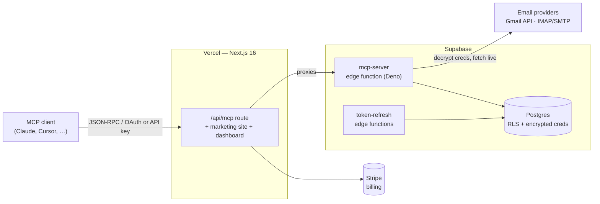

# MCPEmails

**Give your AI agent an inbox.** A hosted [Model Context Protocol](https://modelcontextprotocol.io) server that lets Claude, Cursor, or any MCP‑compatible client read, search, send, organize, and schedule email through your existing mailboxes — without ever storing your mail.

[](https://glama.ai/mcp/servers/Albretsen/MCPEmails)
[](https://www.npmjs.com/package/mcpemails)
[](https://registry.modelcontextprotocol.io/v0/servers?search=mcpemails)
[](LICENSE)

> Connect a mailbox once, paste one URL into your agent, and it can work your inbox live. Email is fetched on demand and never retained; credentials are encrypted at rest and decrypted only at call time inside an isolated edge function.

🔗 **[mcpemails.com](https://mcpemails.com)** · 📚 **[Docs](https://mcpemails.com/docs)** · 💳 **[Pricing](https://mcpemails.com/pricing)**

---

## Contents

- [How it works](#how-it-works)
- [Quick start (connecting an agent)](#quick-start-connecting-an-agent)
- [Capabilities](#capabilities)
- [Tools](#tools)
- [OAuth scopes](#oauth-scopes)
- [Supported providers](#supported-providers)
- [Pricing](#pricing)
- [Architecture](#architecture)
- [Repository layout](#repository-layout)
- [Local development](#local-development)
- [Environment variables](#environment-variables)
- [Database & migrations](#database--migrations)
- [Deployment](#deployment)
- [Self-hosting](#self-hosting)
- [Internationalization](#internationalization)
- [Security model](#security-model)

---

## How it works

1. **Connect a mailbox.** Sign in at [mcpemails.com](https://mcpemails.com) and connect Gmail (one‑click OAuth) or any IMAP/SMTP account (app password). Credentials are encrypted with AES‑256‑GCM before they touch the database.
2. **Get access.** OAuth‑capable clients (claude.ai, Claude Desktop, Cursor) connect in one click via OAuth 2.0 + PKCE. Everything else uses a scoped API key (`mcpe_…`).
3. **Point your client at the server.** The MCP endpoint is a single URL:
   ```
   https://mcpemails.com/api/mcp
   ```
4. **Your agent works the inbox.** It calls tools like `inbox_list`, `email_read` (`action: "search"`), `email_compose` (`action: "send"`), and `schedule` (`action: "create"`). Each request fetches live from your provider — nothing is mirrored or cached server‑side.

Permissions are scoped per key, so you can hand an agent `read:email` only, or grant it send and folder management without ever exposing delete.

## Quick start (connecting an agent)

**Claude Desktop / Cursor (OAuth):** add a remote MCP server pointing at `https://mcpemails.com/api/mcp` and approve the consent screen. Pick the scopes the agent should have.

**API key (any MCP client):** create a key in the dashboard, choose its scopes and (optionally) restrict it to specific inboxes, then send it as a bearer token:

```jsonc
// Example MCP client config
{
  "mcpServers": {
    "mcpemails": {
      "url": "https://mcpemails.com/api/mcp",
      "headers": { "Authorization": "Bearer mcpe_your_key_here" }
    }
  }
}
```

The protocol is JSON‑RPC 2.0 over HTTP (MCP `2025-06-18`, Streamable transport). Start every session with `inbox_list` — it returns the inboxes the key can reach, their per‑provider capabilities, and a versioned compatibility profile. The profile marks normalized operations as `exact`, `different`, or `unavailable`, so agents can preserve provider differences rather than silently weakening a request.

### Setup guides

Copy‑paste instructions per client, including where each one keeps its config file: **[mcpemails.com/docs/clients](https://mcpemails.com/docs/clients)**.

[Claude](https://mcpemails.com/docs/claude) · [Claude Code](https://mcpemails.com/docs/claude-code) · [ChatGPT](https://mcpemails.com/docs/chatgpt) · [Cursor](https://mcpemails.com/docs/cursor) · [VS Code](https://mcpemails.com/docs/vscode) · [Cline](https://mcpemails.com/docs/cline) · [Windsurf](https://mcpemails.com/docs/windsurf) · [Gemini CLI](https://mcpemails.com/docs/gemini-cli) · [Zed](https://mcpemails.com/docs/zed) · [JetBrains](https://mcpemails.com/docs/jetbrains) · [Raycast](https://mcpemails.com/docs/raycast) · [Warp](https://mcpemails.com/docs/warp) · [curl](https://mcpemails.com/docs/curl)

## Capabilities

- **Live, never stored** — email is read straight from your provider on each call; no message bodies are persisted.
- **Multi‑provider** — Gmail via OAuth, plus any IMAP/SMTP mailbox (Fastmail, iCloud, Yahoo, Zoho, Yandex, self‑hosted…) via app password.
- **No relay** — outbound mail is sent through *your* provider's SMTP/API, from your real address.
- **Granular scopes** — eight permission scopes, grantable independently per API key and per inbox.
- **Batch & search‑and‑act** — read, move, delete, or flag up to hundreds of messages in one call, including "search then move/delete" combinators.
- **Drafts & scheduling** — compose drafts and queue messages for future send (server‑side dispatch).
- **Provider‑agnostic search** — Gmail syntax, IMAP `SEARCH`, and JMAP are normalized behind one `email_read` (`action: "search"`) interface.
- **Team‑ready**: workspaces, members, roles, SSO, and an audit log on the Team plan.

## Tools

16 tools you call directly. Most are resource-oriented and take an `action` argument that selects the specific operation (and, for actions that need different privileges, the required scope):

- `inbox_list` - Lists the inboxes the key can reach, with each one's provider capabilities.
- `email_read` - Lists, reads and searches messages, in batches, plus attachments, extracted attachment text and the original `.eml`.
- `email_organize` - Moves, copies, flags and archives messages, singly, in batches, or by search.
- `email_delete` - Trashes or permanently deletes messages, singly, in batches, or by search.
- `email_compose` - Sends, replies and forwards through your own provider, from your real address.
- `folder_list` - Lists folders (labels on Gmail) with their provider-native IDs and message counts. Read-only.
- `folder` - Creates, renames and deletes folders (labels on Gmail).
- `draft_list` - Lists the drafts saved in the inbox, with their draft ids. Read-only.
- `draft` - Creates, updates, sends and deletes drafts, including provider-native replies.
- `schedule_list` - Lists what is queued for future delivery. Read-only.
- `schedule` - Queues a message for future delivery, and cancels one that is queued.
- `signature_get` - Reads the signature and sender name configured for an inbox. Read-only.
- `signature_set` - Sets the signature appended to outbound mail, and the sender name.
- `automation_read` - Lists triage rules, reads one, shows run history, and dry-runs a filter. Read-only.
- `automation` - Creates, updates, enables, disables and deletes unattended triage rules, with no model in the loop.
- `contact_search` - Looks up contacts by scanning recent mail live, with no stored address book.

| Tool | Actions | Scope(s) |
| --- | --- | --- |
| `inbox_list` | *(single action)* | `read:email` |
| `email_read` | `list`, `read`, `read_batch`, `search`, `attachment`, `extract`, `original` | `read:email` (`search` also accepts `search:email`) |
| `email_organize` | `move`, `move_batch`, `copy`, `copy_batch`, `flag`, `archive`, `search_and_move` | `manage:folders` |
| `email_delete` | `delete`, `delete_batch`, `search_and_delete` | `delete:email` |
| `email_compose` | `send`, `reply`, `forward` | `send:email` |
| `folder_list` | *(single action)* | `read:email` |
| `folder` | `create`, `rename`, `delete` | `manage:folders` |
| `draft_list` | *(single action)* | `manage:drafts` |
| `draft` | `create`, `reply`, `update`, `send`, `delete` | `manage:drafts` (create/reply/update/delete), `read:email` (reply also), `send:email` (send) |
| `schedule_list` | *(single action)* | `schedule:email` |
| `schedule` | `create`, `cancel` | `schedule:email` |
| `signature_get` | *(single action)* | `read:email` |
| `signature_set` | *(single action)* | `send:email` |
| `automation_read` | `list`, `get`, `runs`, `preview` | `manage:automations` |
| `automation` | `create`, `update`, `enable`, `disable`, `delete` | `manage:automations` |
| `contact_search` | *(single action)* | `manage:contacts` |

A full-scope key sees **22** tools in `tools/list`: the 16 above plus six app-only tools (`approval_review`, `approval_decide`, `approval_update`, `approval_schedule`, `bulk_execute`, `bulk_cancel`). Those carry `_meta.ui.visibility: ["app"]` and drive the review card an MCP client renders for a held send or a previewed bulk operation, rather than being composed by hand.

Notes:
- Tools accept either an explicit `inbox_id` (UUID) or an `inbox` email address; single‑inbox keys auto‑resolve the target.
- Batch actions cap at 50 (`email_read`'s `read_batch`) to 500 (move/delete/flag) messages per call.
- For a targeted mutation, first use `email_read` with `action: "search"`, then pass the returned `message_id` or `message_ids` to `email_organize` or `email_delete`. Search fields are accepted only by `search_and_move` and `search_and_delete` mutation actions.
- `contact_search` scans recent mail live, so there is no stored address book.
- `email_read`'s `original` action returns one complete provider-stored MIME message as a portable `.eml` file (up to 25 MB). It is read-only and never marks the message as read.
- `draft`'s `send` action requires `send:email`, not `manage:drafts`, so a key that can only manage drafts can't use them to bypass the send‑mail consent.
- `draft`'s `reply` action creates an unsent, provider-native reply in the source conversation. It needs both `manage:drafts` and `read:email`, and defaults to replying only to the sender.
- The read-only halves (`folder_list`, `draft_list`, `schedule_list`, `signature_get`, `automation_read`) were split out of their write tools on 2026-09-09, so a read-only key is never shown a write tool. The old combined shapes (`folder` `action: "list"`, `draft` `action: "list"`, `schedule` `action: "list"`, `signature` `action: "get"`/`"set"`, `automation` `action: "list"`/`"get"`/`"runs"`/`"preview"`) are still accepted on the wire for already-connected clients, but are no longer advertised.
- `automation` manages unattended scheduled triage rules: a stored search plus one fixed action, evaluated on a cadence with no model in the loop. There is no delete-mail action, a `forward` always waits for human approval, and `draft_reply` only ever writes a draft. See `docs/automations-trust-boundary.md`.
- `tools/list` only returns the tools your key (or OAuth token) is actually scoped for.

## OAuth scopes

| Scope | Grants |
| --- | --- |
| `read:email` | List inboxes & folders; list, read, and search messages; read an inbox's signature |
| `search:email` | Narrower alternative that grants only `email_read`'s `search` action |
| `send:email` | Send, reply and forward; set the signature and sender name; also required to send a draft |
| `manage:folders` | Create/rename/delete folders; move, copy, flag and archive messages |
| `delete:email` | Trash or permanently expunge messages |
| `manage:drafts` | Create, edit, and delete drafts (sending one also requires `send:email`) |
| `manage:contacts` | Live contact lookup from recent mail |
| `schedule:email` | Queue messages for future delivery |
| `manage:automations` | Create and manage unattended scheduled triage rules (no delete action; forwards stay approval-gated) |

## Supported providers

| Provider | Connect via | Read/Search | Send | Folders | Permanent delete | Drafts |
| --- | --- | --- | --- | --- | --- | --- |
| **Gmail / Google Workspace** | OAuth 2.0 | ✅ | ✅ | Labels | Trash only | ✅ |
| **Fastmail** | App password (IMAP/SMTP) | ✅ | ✅ | ✅ | ✅ | ✅ |
| **iCloud, Yahoo, Zoho, Yandex** | App password (IMAP/SMTP) | ✅ | ✅ | ✅ | ✅ | ✅ |
| **Any IMAP/SMTP mailbox** | App password | ✅ | ✅ | ✅ | ✅ | ✅ |
| **Outlook / Microsoft 365** | OAuth 2.0 | 🚧 built, gated pending verification | | | | |

> Outlook OAuth is implemented end‑to‑end but currently gated behind Microsoft publisher verification; it is hidden from the connect UI until it ships.

## Pricing

The value metric is **connected inboxes**. Free connects one mailbox, Personal connects up to three, Pro connects every mailbox you own, and Team adds people, roles, and a separate workspace per client. Annual billing saves about 20%.

| | **Free** | **Personal** | **Pro** | **Team** |
| --- | --- | --- | --- | --- |
| Price | $0 | $5/mo · $48/yr ($4/mo) | $15/mo · $144/yr ($12/mo) | $79/mo · $756/yr ($63/mo) |
| Connected inboxes | 1 | 3 | Unlimited | Unlimited |
| API keys | Unlimited | Unlimited | Unlimited | Unlimited |
| Members | 1 (owner only) | 1 (owner only) | 1 (owner only) | Unlimited, with roles |
| Fair‑use rate limit | 60 req/min | 120 req/min | 300 req/min | 1,000 req/min |
| Team roles & workspaces | No | No | No | ✅ |
| SSO (SAML/OIDC) + audit log | No | No | No | ✅ |
| Support | Community | Email | Email | Priority |

Per‑API‑key limits also apply (100 req/min · 1,000/hr · 10,000/day). Rate limits are retryable: they come back as JSON-RPC error `-32003` with `data.retry_after` in seconds.

Every workspace additionally has a **fair-use ceiling** on billable actions per billing period. It is an abuse guard, not a plan feature: it sits far above any observed real usage, is never shown to customers, and cannot be bought past. Hitting it is not retryable and not a JSON-RPC error: it comes back as a normal tool result with `isError: true` and a `_meta["com.mcpemails/usage_limit"]` block, and clears at `reset_at`.

Internal plan ids predate the names: `solo` is sold as **Pro** and `pro` is sold as **Team**. The newer `personal` id is the only one that matches its display name, **Personal**. Every user who existed before the 2026-08-19 repricing keeps unlimited inboxes for free, permanently. See [`apps/web/src/lib/stripe/plans.ts`](apps/web/src/lib/stripe/plans.ts).

## Architecture



- **`/api/mcp`** is a thin Next.js route handler that proxies to the Supabase edge function `mcp-server` — the real MCP implementation, where credentials are decrypted and provider calls are made.
- **The Postgres database** stores workspaces, members, inboxes (encrypted tokens/passwords), hashed API keys, OAuth clients, scheduled sends, and an activity log — all guarded by Row‑Level Security.
- **Cron edge functions** refresh Gmail/Outlook OAuth tokens before expiry.

**Stack:** Next.js 16 (App Router) · React 19 · next‑intl 4 · Supabase (Auth, Postgres, Edge Functions) · Stripe · Resend · TypeScript. Email parsing/sanitization via `mailparser`, `jsdom`, and `isomorphic-dompurify`.

## Repository layout

```
.
├── apps/
│   └── web/                     # Next.js 16 app (marketing, dashboard, /api/mcp proxy)
│       ├── app/                 # App Router routes ([locale], dashboard, api, auth)
│       ├── components/          # marketing/ + dashboard/ React components
│       ├── messages/            # next-intl translations (en, nb, es, fr, zh)
│       ├── src/lib/             # stripe/, supabase/, blog/, crypto helpers
│       └── proxy.ts             # middleware: i18n + Supabase session + CDN cache
├── supabase/
│   ├── functions/
│   │   ├── mcp-server/          # the MCP server (tools, auth, scopes)
│   │   ├── gmail-token-refresh/
│   │   └── outlook-token-refresh/
│   └── migrations/              # SQL migrations (schema + RLS)
└── package.json                 # npm workspaces (apps/*)
```

## Local development

**Prerequisites:** Node.js 20+, npm, and the [Supabase CLI](https://supabase.com/docs/guides/cli) (for migrations and edge functions).

```bash
# 1. Install (npm workspaces — run from the repo root)
npm install

# 2. Configure environment
cp .env.example apps/web/.env.local
#   then fill in the values (see below) and generate the two secrets:
openssl rand -hex 32   # ENCRYPTION_KEY
openssl rand -hex 32   # CSRF_SECRET

# 3. Run the web app (http://localhost:3000)
npm run dev

# 4. Production build
npm run build
```

> `next.config.js` validates required env vars at build/start and rejects weak `ENCRYPTION_KEY` values, so a misconfigured environment fails fast instead of at runtime.

## Environment variables

Copy [`.env.example`](.env.example) and fill in real values. Required in every environment:

| Variable | Purpose |
| --- | --- |
| `NEXT_PUBLIC_SUPABASE_URL` / `NEXT_PUBLIC_SUPABASE_ANON_KEY` | Supabase client (public) |
| `SUPABASE_SERVICE_ROLE_KEY` | Server‑side admin key (bypasses RLS) — **secret** |
| `NEXT_PUBLIC_APP_URL` | Canonical base URL; drives OAuth redirect URIs |
| `GOOGLE_SITE_VERIFICATION` *(optional)* | Google Search Console HTML-tag verification token; set only in production |
| `ENCRYPTION_KEY` | 64‑hex AES‑256‑GCM key for credentials at rest — **secret** |
| `CSRF_SECRET` | 64‑hex HMAC key for CSRF tokens (distinct from above) — **secret** |

Feature‑dependent:

| Variable(s) | Needed for |
| --- | --- |
| `GMAIL_CLIENT_ID` / `GMAIL_CLIENT_SECRET` | Gmail OAuth (`gmail.readonly`, `gmail.send`, `gmail.modify`) |
| `OUTLOOK_CLIENT_ID` / `OUTLOOK_CLIENT_SECRET` / `OUTLOOK_TENANT_ID` | Outlook OAuth (`Mail.Read`, `Mail.Send`, `Mail.ReadWrite`, `offline_access`) |
| `NEXT_PUBLIC_OAUTH_VERIFICATION_PENDING` | Shows the unverified‑app warning until Google/Microsoft verification completes |
| `STRIPE_SECRET_KEY` / `STRIPE_WEBHOOK_SECRET` / `NEXT_PUBLIC_STRIPE_PUBLISHABLE_KEY` | Billing |
| `STRIPE_PRICE_PERSONAL_MONTHLY` / `_YEARLY`, `STRIPE_PRICE_SOLO_MONTHLY` / `_YEARLY`, `STRIPE_PRICE_PRO_MONTHLY` / `_YEARLY` | Plan price IDs (`personal` = Personal, `solo` = Pro, `pro` = Team) |

> Fastmail and other IMAP providers connect via app password and need no OAuth credentials.

## Database & migrations

Schema and Row‑Level Security policies live in [`supabase/migrations/`](supabase/migrations/). Core tables: `workspaces`, `workspace_members`, `inboxes` (encrypted credentials, soft‑deleted), `api_keys` (hashed, scoped, inbox‑restricted), `oauth_clients`, `scheduled_sends`, `workspace_invites`, and a month‑partitioned `activity_log`.

```bash
# Apply migrations to the linked project
npx supabase db push

# Generate TypeScript types from the live schema
npx supabase gen types typescript --linked > apps/web/src/types/database.ts
```

> The Supabase CLI is the source of truth for DB changes in this project.

## Deployment

**Web app → Vercel** (project `mcp-emails-web`):

```bash
vercel --prod --yes
```

Security headers and function timeouts are defined in `vercel.json`. The marketing routes are served with a CDN‑cacheable `Cache-Control` (set in `proxy.ts`) so crawlers and repeat visitors hit the edge cache; the dashboard, auth, and API routes stay `no-store`.

**MCP server → Supabase edge function:**

```bash
npx supabase functions deploy mcp-server --project-ref <your-project-ref> --no-verify-jwt
```

## Self-hosting

Don't want to trust the hosted service with your mail? Run the **same MCP server** on your own
machine. [`self-host/`](self-host/) ships a containerized stack (Postgres + PostgREST + the Deno
server, no Supabase/Stripe/dashboard), so your credentials are encrypted with a key only you hold
and decrypted only inside your own container.

```bash
cd self-host
make setup      # generate secrets (.env)
make up         # build + start the stack
export IMAP_PASSWORD='your-app-password'
make provision EMAIL=you@example.com IMAP_HOST=imap.fastmail.com SMTP_HOST=smtp.fastmail.com SERVICE=fastmail
make key NAME="my agent"   # mint an mcpe_ key, then point your client at http://localhost:8787
```

It is IMAP/SMTP-first (Fastmail, iCloud, Yahoo, Zoho, Yandex, generic) via app password; Gmail/Outlook
OAuth and the web dashboard remain hosted-only. The container runs `supabase/functions/mcp-server/`
unmodified; see [`self-host/README.md`](self-host/README.md) for the full guide.

## Internationalization

Built with **next‑intl** (`localePrefix: 'as-needed'`, `localeDetection: false` for stable canonical URLs). English is served at `/`; other locales carry a prefix (`/nb`, `/es`, `/fr`, `/zh`). Translations live under [`apps/web/messages/`](apps/web/messages/).

Supported locales: **English, Norwegian Bokmål, Spanish, French, Chinese (Simplified)**.

## Security model

- **Credentials encrypted at rest** with AES‑256‑GCM; decrypted only inside the edge function at call time.
- **No message storage** — email bodies and attachments are fetched live and never persisted. Attachment text extraction runs transiently in the request and returns no raw attachment bytes.
- **API keys are hashed** (only a prefix is stored for display) and scoped per permission and per inbox, with optional expiry.
- **OAuth 2.0 + PKCE** for client authorization; **Dynamic Client Registration** (RFC 7591) for MCP clients.
- **Row‑Level Security** isolates every workspace's data at the database layer.
- **Strict CSP**, HSTS, `X-Frame-Options: DENY`, and related headers on every response.

## License

MCP Emails is open source under the [GNU Affero General Public License v3.0](LICENSE) (AGPL‑3.0). The hosted service at [mcpemails.com](https://mcpemails.com) runs the same server you can [self-host](self-host/), so you can read the code, verify it, and run it yourself. See [`/security`](https://mcpemails.com/security) for the trust model.

---

<sub>Send and receive email from any agent. © MCPEmails, AGPL‑3.0.</sub>
